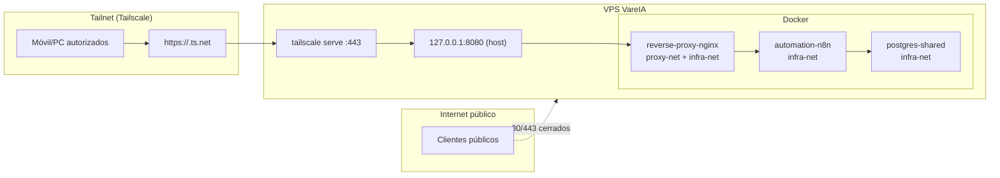

# Arquitectura (Mermaid)

Estado actual (privado por Tailscale, sin exposición pública 80/443):

Notas:
- `reverse-proxy-nginx` no publica puertos públicos; solo binding local `127.0.0.1:8080`.
- El acceso web operativo se realiza por Tailscale Serve (`*.ts.net`).
- `n8n` y `postgres` permanecen internos en `infra-net`.
